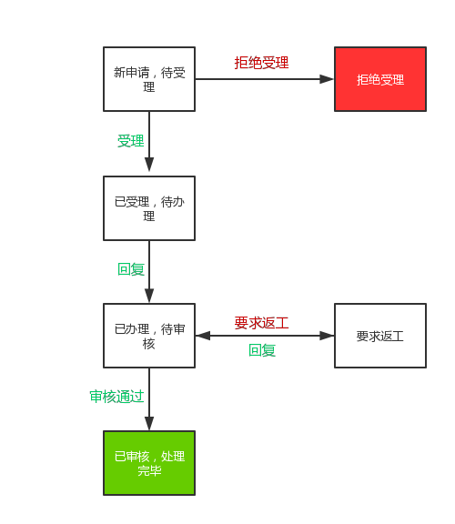

# 申请处理流程

依申请公开申请从申请提交至处理完毕将在以下 6 种状态中转换：

- 新申请，待受理
- 已受理，待办理
- 拒绝受理
- 已办理，待审核
- 要求返工
- 已审核，处理完毕

## 新申请，待受理

用户在前台页面中提交申请或者管理员在后台中提交申请后，申请将处于`新申请，待受理`状态，需要拥有权限的管理员进行`受理`或者`拒绝受理`操作。

## 已受理，待办理

管理员`受理`申请后，申请将进入`已受理，代办理`状态，管理员需要对申请进行`办理`操作。

## 拒绝受理

管理员`拒绝受理`申请后，申请将进入`拒绝受理`状态，至此申请处理流程已完毕，无需进行下一步操作。

## 已办理，待审核

管理员对`已受理，待办理`的申请进行`办理`操作后，申请将进入`已办理，待审核`状态，需要拥有审核权限的管理员进行`审核`或者`要求返工`操作。

## 要求返工

拥有审核权限的管理员对`已办理，待审核`的申请进行`要求返工`操作后，申请将进入`要求返工`状态，负责办理此申请的管理员需要进一步完善回复内容。

## 已审核，处理完毕

拥有审核权限的管理员对`已办理，待审核`的申请进行`审核`操作后，申请将进入`已审核，处理完毕`状态，至此申请处理流程已完毕，无需进行下一步操作。
