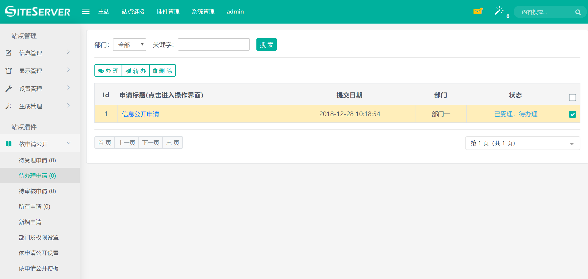
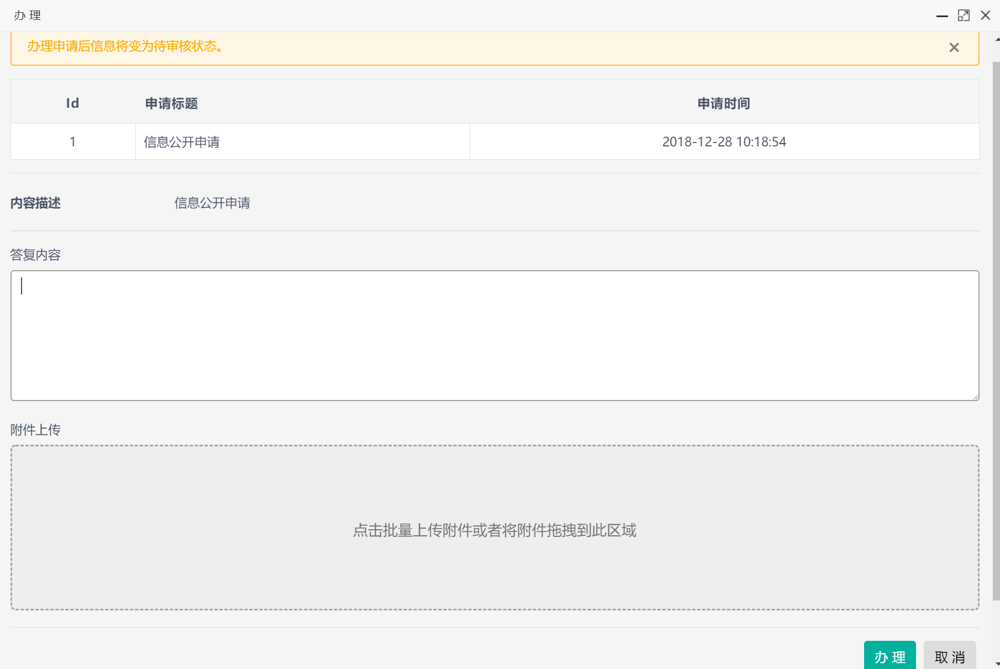
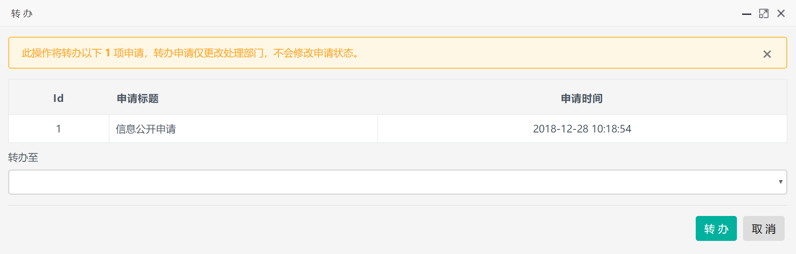

# 办理申请

进入依申请公开插件，点击待办理申请菜单，出现办理申请界面：

管理员可以在这里选择具体的申请进行`办理`或者`转办`操作。

## 办理操作

选择需要办理的申请后点击办理按钮，系统将弹出办理申请界面：

在此，管理员需要针对申请进行回复，如果需要附加文件，可以点击附件上传区域上传附件。

管理员对申请进行`办理`操作后，申请将进入`已办理，待审核`状态。

## 转办操作

选择申请后点击转办按钮，系统将弹出转办申请界面：

转办必须选择需要转办至的部门名称。

转办申请仅更改处理部门，不会修改申请状态。
