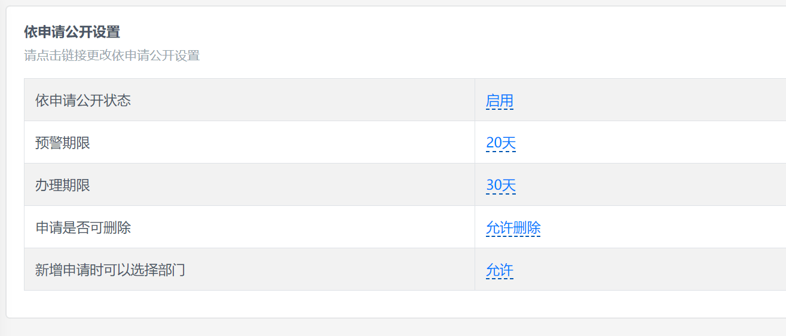

# 依申请公开设置

开始使用依申请公开之前，需要设置插件选项。

## 依申请公开状态

依申请公开默认为开启状态，如果设置为关闭状态，申请提交界面将显示关闭信息：

## 预警期限与办理期限

预警期限默认为 20 天，办理期限默认为 30 天，如果接近或者到达预警及办理期限，申请在后台列表中将根据申请提交时间显示不同的预警色及办理提醒。

如果不希望出现办理提醒，可以将预警期限或办理期限设置为 0。

## 申请是否可删除

申请是否可删除用于控制后台管理员是否有权限删除申请，默认为可删除状态，如果设置为不可删除，依申请公开管理员将无法删除申请。

## 新增申请时可以选择部门

新增申请时可以选择部门选项用于前台依申请公开表单提交界面是否出现部门选择项，默认是允许状态，用户可以在提交时选择依申请公开的处理部门。

无论前台用户提交申请时是否选择处理部门，后台管理员均可以根据实际情况在办理申请时候转办申请至其他部门。
