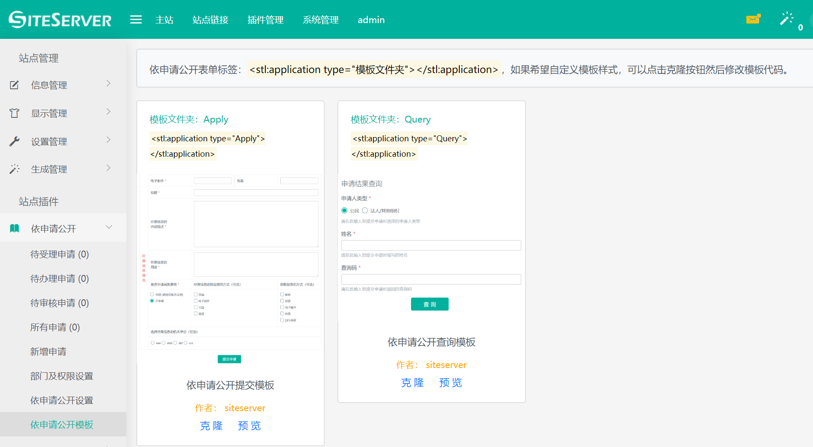
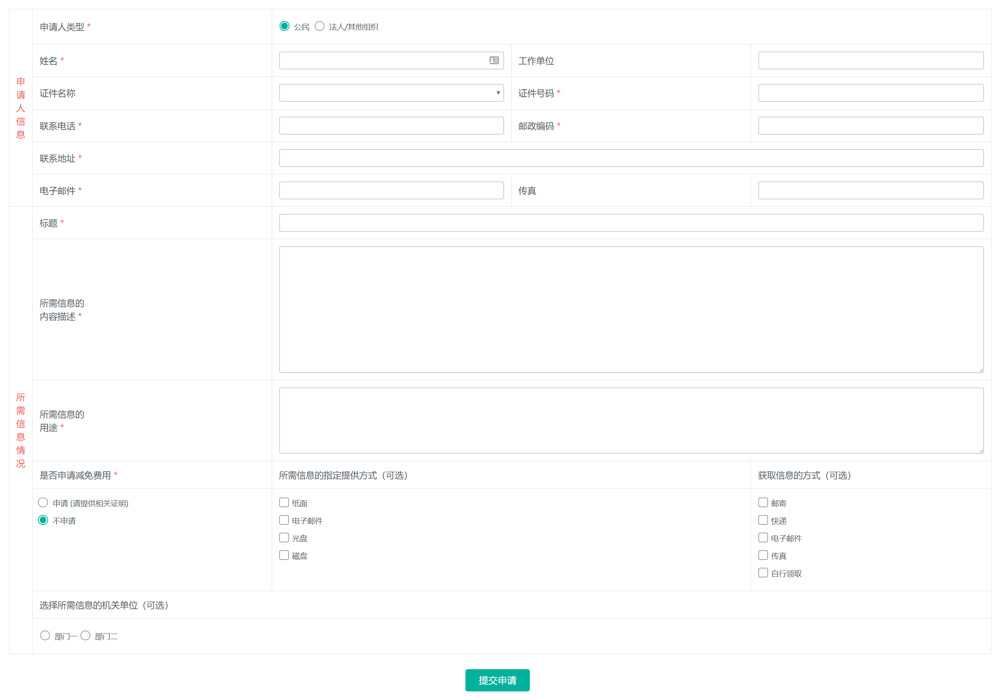
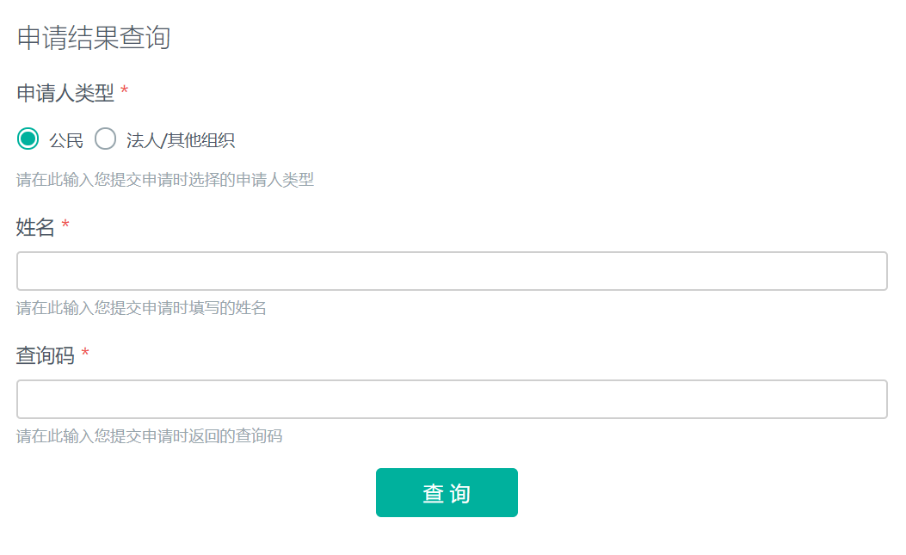
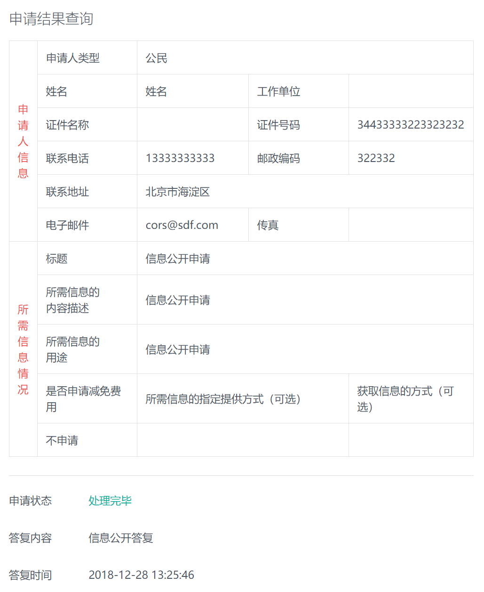

# 依申请公开模板

进入依申请公开插件，点击依申请公开模板菜单，出现依申请公开模板界面：



系统带有两个默认模板，分别用于前台页面提交申请以及前台页面查询申请办理结果使用。

## 申请提交标签

依申请公开提交标签为：

```html
<stl:application type="Apply"></stl:application>
```

将标签放到模板并生成页面后将看到依申请公开提交表单：



## 申请结果查询标签

依申请公开查询标签为：

```html
<stl:application type="Query"></stl:application>
```

将标签放到模板并生成页面后将看到依申请公开查询表单：



输入姓名与查询号点击查询按钮，如果申请正在办理中，界面将显示申请内容以及申请状态：


如果申请已被拒绝办理或者申请已经办理完成并通过申请，界面将显示申请内容、状态以及回复信息：


