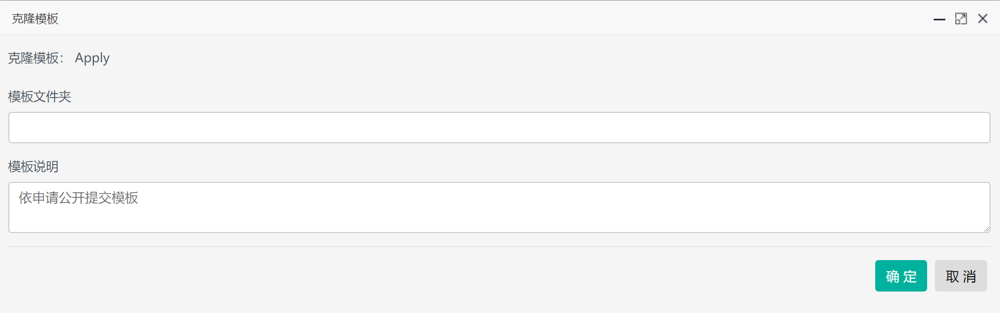
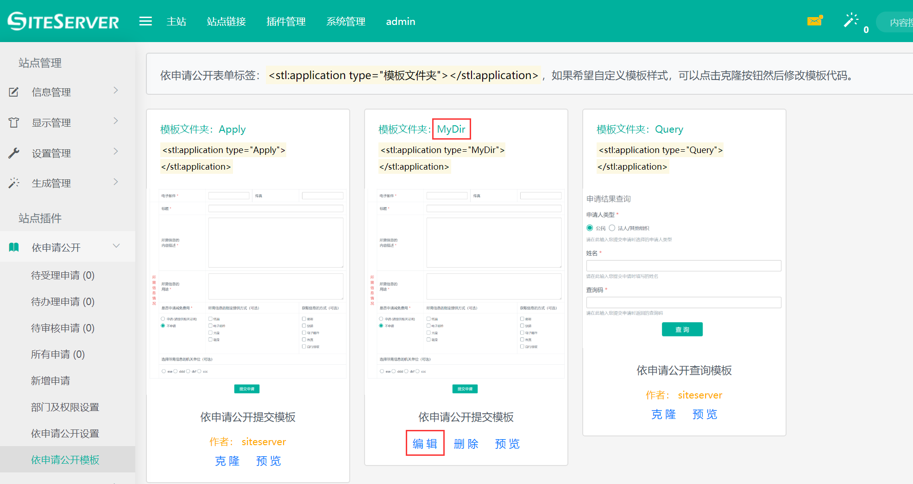
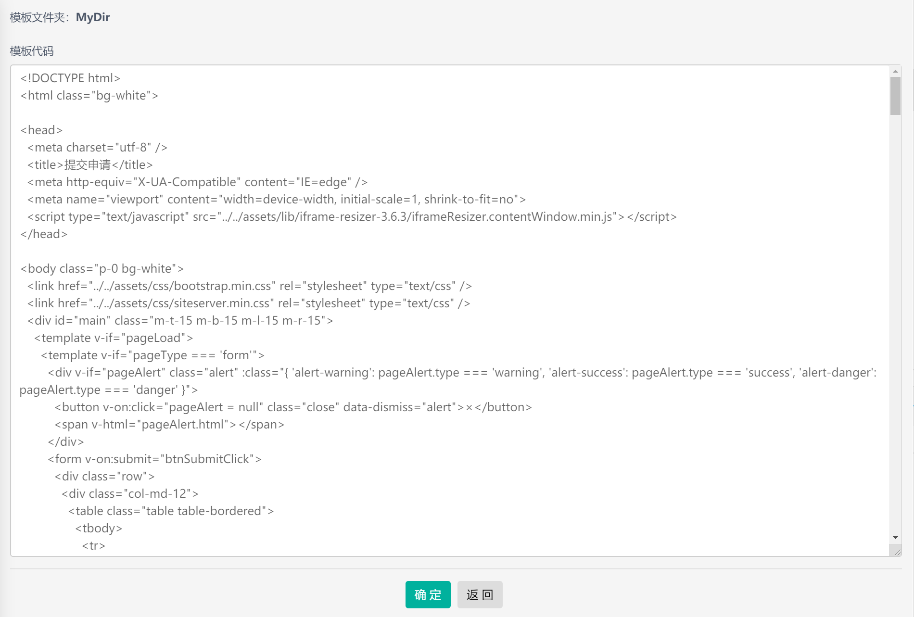

# 自定义显示样式

除了默认模板，你也可以点击`克隆`按钮，从而实现自定义显示样式。

## 克隆模板

系统自带的模板模板代码和样式是无法修改的，不过通过点击`克隆`按钮能够复制一份模板，通过修改模板代码从而自定义显示样式。

点击克隆按钮后出现克隆选项：



其中模板文件夹指的是存放模板的文件夹路径，每一个依申请公开模板都存放在一个单独的文件夹中，输入文件夹名称后系统将复制模板的文件夹至指定的文件夹中。

## 编辑模板代码

克隆模板完成后，在依申请公开模板界面中将出现新克隆的模板：



点击`编辑`按钮，进入自定义模板代码界面：



编辑完毕后可以点击`预览`按钮查看效果。

## 调用自定义模板

自定义模板的调取标签为：

```html
<stl:application type="文件夹名称"></stl:application>
```

其中 type 属性为克隆默认模板时输入的文件夹名称。
